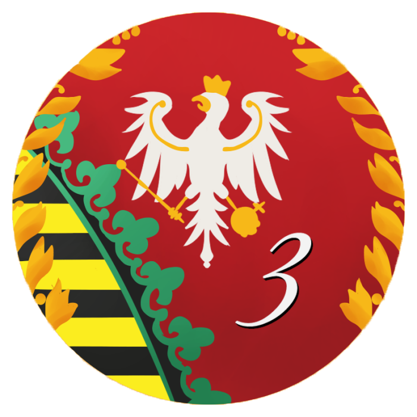

  
    
  
  
  
  
  
  <h1>3. Dywizja - Strona internetowa pułku</h1>

> Strona służy jako wizytówka naszej społeczności oraz jako historyczne archiwum naszej bogatej historii z czasów, gdy graliśmy w *Holdfast: Nations At War* i *Mount & Blade: Warband*.

## 🛠 Technologie

Strona internetowa 3. Dywizji została napisana w oparciu o najnowsze standardy webowe, w celu zapewnienia błyskawicznego ładowania strony i mroczny, przejrzysty design:

- **Framework:** [Next.js](https://nextjs.org/) (App Router)
- **Styling:** [Tailwind CSS](https://tailwindcss.com/)
- **Język:** [TypeScript](https://www.typescriptlang.org/)
- **Hosting:** [Vercel](https://vercel.com/)

Projekt jest automatycznie budowany i wdrażany przez platformę Vercel przy każdym nowym commicie do głównej gałęzi (`main`).

## 🎖 Historia

Historia 3. Dywizji sięga lat wstecz, od formowania szeregów w *Mount & Blade: Warband*, przez złotą erę pułku w *Holdfast: NaW*, aż po obecny, błękitny front w Foxhole.

---

*Za Callahana! Za imperium Wardenów.*

---

## 📋 Notatki 

### ✅ Zrobione 
- [x] **Strona Główna:** Mroczny, militarny klimat dopasowany do Holdfast/Foxhole
- [x] **Nawigacja (Navbar):** W pełni responsywna, z przejściami
- [x] **Sekcja Hero:** Wyśrodkowana, czytelna z logiem 3. Dywizji
- [x] **Technikalia:** Repozytorium na GitHubie, Vercel podpięty (strona widoczna w sieci)
- [X] **Podrasowanie pliku README.md:** Dodanie loga 3. Dywizji oraz odpowiednich tagów

### 🛠️ W trakcie
- [ ] **Wideo w tle (Hero):** Podpiąć lekki plik wideo `.mp4` w pętli (w stylu menu głównego z gier takich jak Factorio/Earth 2160)
- [ ] **Podstrona - Oś Czasu:** Pionowa, przewijana oś czasu z historią pułku
- [ ] **Podstrona - Hala Chwały:** Sekcja z profilami członków Kadry Oficerskiej 3. Dywizji

### 💡 Pomysły 
- [ ] Animowane Statystyki na stronie głównej
- [ ] Panel "Dlaczego My?" (3 kafelki z ikonami)
- [ ] Baza Wiedzy / Akademia (poradniki dla rekrutów)
- [ ] Live Widget Discorda na stronie
- [ ] Galeria Wideo (najlepsze filmy z operacji)
- [ ] Zakup i podpięcie domeny `3dywizja.pl`
- [ ] Sekcja Kadry (Dowództwo): Zaimplementować e-sportowe karty postaci na stronie głównej w formie piramidy, pionowej hierarchii od najwyższej rangi do najniższej
- [ ] Wsparcie dla telefonów (aby ładnie strona internetowa wyglądała na telefonie)

## 🤝 Współtwórcy

Osoby, które aktywnie tworzą kod naszej strony:

